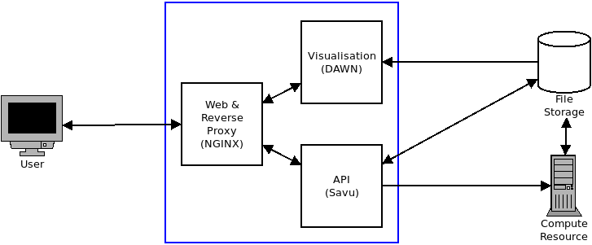
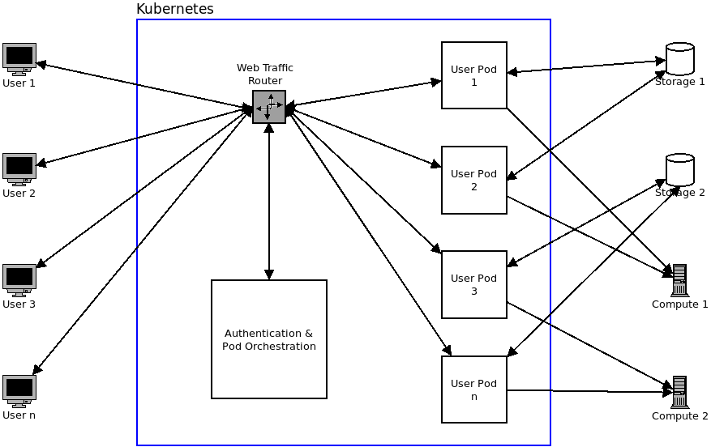

# Documentation

## Goal

Provide a simple way for users to configure and initiate Savu workflows in a
facility agnostic manner with little to no software setup on the users part
required.

### Requirements

- Intuitive web based alternative to Savu command line  
  This should be clear to users who are familiar with Savu (i.e. there should be
  a clear mapping from `savu_config` commands to the respective UI component) as
  well as being easy to learn for new users (i.e. not requiring extensive
  knowledge of Savu, `savu_config`, the underlying filesystem or compute
  resource).
- Integrated job submission and status reporting  
  The web interface should show at minimum a list of the users cluster jobs and
  their status (queued, running, terminated, etc.), ideally it should also allow
  the output of jobs to be inspected and jobs to be terminated.
  Cluster submission should be exposed to the user as two options: preview and
  full.  
  Preview is for fast interactive previews and should use a high availability
  queue with a short job time limit (it is assumed that the user adjusts the
  relevant preview parameters in the process list to restrict processing to be
  faster than the timeout, there is no common way to do this in Savu due to the
  multiple places datasets may be downsampled).  
  Full is used to submit full reconstructions once the user is happy with the
  process list and should use the relevant queue for full reconstruction jobs.
- Visualisation  
  The interface should include basic visualisation of raw and output datasets
  with slicing support, similar to what is available in DAWN.
- Facility agnostic  
  This allows the solution to be deployed at any facility that may be
  interested in providing this interface to their users. The interest from
  Diamond and ISIS require this to be functional on infrastructure at both
  Diamond and SCD.  
  Part of this requirement also includes making the software as portable as
  possible and keeping infrastructure requirements to a minimum.

## Design

The design of a solution to address this goal can be split into several
independent modules.

### Savu API

This provides a RESTful API that includes:
  - access to `savu_config`-like functionality
  - ability to list data files and process lists from a storage resource
  - ability to submit to and query compute resource queues

The RESTful API is described [here](api/readme.md).

### Web interface

This web application consumes the Savu API and provides the graphical interface
for the user to interact with.

The web interface consists of several "panels":
- File browsing/searching  
  Provides a means of searching for both datasets and process lists on the
  underlying storage service.
- Process list editor  
  Presents `savu_config` like functionality for creating and editing process
  lists.
- Dataset preview  
  Shows an interactive preview of a dataset (either raw, partially processed or
  fully processed datasets).
- Cluster job control  
  Used to submit, cancel and monitor cluster jobs (both preview and full
  reconstruction).

### Orchestration

An instance of the application stack required to serve a single user consists
of:
  - an instance of the Savu API
  - an instance of the DAWN data server
  - static web server
  - reverse proxy

In order to make these components as portable as possible they have been
constructed to each be deployed via Docker containers, with the exception of the
web and reverse proxy server which run in a single container.

The DAWN data server is provided by [Dan's
image](https://github.com/DanNixon/dockerfiles/tree/master/dawn-dataserver).

As it is dependant on Savu itself, the Savu API image is built on top of [Dan's
image](https://github.com/DanNixon/dockerfiles/tree/master/savu). Selecting the
base image tag will likely be the easiest method of selecting a specific Savu
version, should the user wish to select a previous version.

The content for the web frontend and reverse proxy for the Savu and DAWN APIs is
performed by NGINX running in the
[LinuxServer.io image](https://hub.docker.com/r/linuxserver/nginx).

These components are deployed for a single user via a Kubernetes Pod, this
allows a simple means of starting and stopping user sessions and allowing access
to multiple versions. It also ensures the service can scale well at a single
facility.

An overview of the components of a user pod and the flow of data between
components is shown in the figure below.



### Authentication

Authentication is to be handled on a per deployment basis. None of the services
described in the previous section provide any authentication.

Running instances of the "user pod" are not exposed outside of the Kubernetes
cluster, there should be a service that handles authentication and proxy to the
running user pods that runs alongside the user pods.

This may be split into two separate services: one to handle authentication and
another to handle routing to the correct user pod and starting/stopping user
pods.

As authentication is facility specific this should be implanted as modular as
possible. For implementations DLS can use the Central Authentication Service
(CAD) which is documented on Confluence. STFC/SCD could probably use user office
accounts (facilities business systems (I think this is what they call themselves
now) or SCD would know more about this).

Starting and stopping pods is trivial with the [Python client
library](https://github.com/kubernetes-client/python) for the Kubernetes API.

The implementation of routing user requests to specific pods requires more work,
ideally by someone more experienced with web infrastructure than me. Essentially
what is required is the ability to inspect the authentication information (e.g.
the `Authorization` header) and assuming that there is a pod started for the
user making the requests, proxy that request to the pod associated with them.

### Reference diagram

This diagram shows what a complete multi-user system may look like.



## Implementation

Much of the implementation detail is outlined in the respective part of the
repository.

### Status

The following parts of the design have been implemented:

- API (**prototype**)
  - Savu functionality (**prototype**)
  - Filesystem integration (**prototype**)
  - Cluster integration (**prototype**)
- Web application (**proof of concept**)
- Authentication/orchestration (**prototype**)
  - Authentication (**not implemented**)
  - Programmatic deployment (**proof of concept**)
  - Web traffic routing (**not implemented**)

Implementation statuses are as follows:

- **prototype**  
  Closely resembles what the production quality system may be. Implementation
  may be refined to produce a production ready system.
- **proof of concept**  
  Demonstrates a technology but requires rewrite to become production ready.

### Cluster access

Cluster access was planned to be performed via
[DRMAA](https://en.wikipedia.org/wiki/DRMAA), a standard API across multiple
resource managers (supported by UGE at DLS and Slurm on SCARF).

The advantages of this being increased portability between facilities that mya
use different resource managers on their compute clusters. The DRMAA API is also
very concise yet contains all the required methods for use in this project.

The [python-drmaa](https://github.com/pygridtools/drmaa-python) package provides
Python bindings to the DRMAA C API, this requires access to the specific
installation of the resource manager (at least for GridEngine and derivatives).
At Diamond this means `/dls_sw` must also be available to the `hebi-api`
container.

### Repository layout

```
.
├── api               (hebi-api container)
│   ├── config        (API application configuration files)
│   └── webservice    (API application Python source)
├── docs              (general documentation)
├── kubernetes        (tools and documentation for Kubernetes deployment)
│   └── pod_launcher  (Python command line tool to launch user pods)
├── misc_examples     (general complete examples not used in the prototype)
└── web               (hebi-web container)
    └── config
        ├── nginx     (NGINX configuration files)
        └── www       (static content for web frontned)
            ├── css   (CSS style files)
            ├── js    (compiled JavaScript)
            └── src   (JavaScript source files)
```

### Deployment instructions

This requires you to have the following installed:
  - Docker
  - kubectl
  - Python 3
  - `npm`/NodeJS (I did this through Docker)

You will also require the ability to push to a Docker container repository that
is accessible from the Kubernetes cluster.

Start:
  - Ensure the images are up to date
    - `cd web/config/www`
      - `npm install`
      - `babel src -d js`
    - Run `build_docker_images.sh`  
      (change the `ORG` variable if you are not me)
  - Push the built images (`hebi-api` and `hebi-web`)
  - Start a user pod
    - `cd kubernetes/pod_launcher/`
      - `./main.py -u [your user id] start`
  - Determine the node port
    - `kubectl get service/uid[your user id]`
  - Access the demo at the URL: `http://[node ip]:[node port]`

Stop:
  - `cd kubernetes/pod_launcher/`
    - `./main.py -u [your user id] stop`

## Issues and Further Development

This section describes issues faced in the implementation of the prototype and
possible actions to remedy these issues in a production ready implementation.

### Authentication/routing

Of the authentication subsystem the only part that presented an issue was how to
route web traffic to the correct user pods. Performing authentication is
relatively trivial (using the example provided on DLS Confluence as a guide) as
is starting and stopping pods.

One possible means is having all traffic handled by a Flask application which
inspects the `Authorization` header of each request to determine the user making
the request, determines the IP of the Pod running their session (possible as the
same service is responsible for authenticating them and starting their Pod) and
proxies their request to the required Pod.

This service may use a separate data store to enable it to be load balanced to
cope with additional traffic at scale.

This solution was not implemented due to time constraints and uncertainty that
there was not a better, more "off the shelf" solution available.

### Cluster access

DRMAA proved difficult to get working in a container, this was due to two main
reasons: unavailability of `/dls_sw` inside containers (see **Filesystem access**
section below) and the use of whitelisted submit hosts.

Lack of filesystem access made this more difficult but not entirely impossible,
it is simply not a good idea to carry forward. This required copying parts of
the UGE installation from `/dls_sw` to somewhere that was available to the
container.

The use of submit host whitelisting was the main issue that prevented this from
working. It's unclear if there is a good solution to this that will allow DRMAA
to be used with UGE a this point.

Regardless of the actual implementation there must be an API that allows
interaction with the cluster that supports (at minimum) the following
operations:
  - list a users active jobs and their status
  - submit a new job with resource specification
  - terminate a running job

The following additional operations will allow for feature enhancements in the
web application:
  - summarise cluster availability
  - provide `stdout` and `stderr` output of jobs (or paths to files containing
    this)

### Filesystem access

Providing access to filesystems is in theory trivial given the number of [Volume
sources supported by
Kubernetes](https://kubernetes.io/docs/reference/generated/kubernetes-api/v1.14/#volume-v1-core).

There were concerns about lifecycle of volumes and ensuring no data loss,
however reading the [documentation on the
subject](https://kubernetes.io/docs/concepts/storage/persistent-volumes/#lifecycle-of-a-volume-and-claim)
does not suggest any such issues are likely to exist.

Regardless of if it should be or not, expect getting access to the equivalent of
`/dls/` at Diamond to be significant effort.

### DAWN data server

After testing the system with a different dataset it was found that the DAWN
dataserver API made assumptions about HDF5 paths that were not valid for all
data files (my test files had the image dataset under `/entry/` whereas Mark had
some that had it under `/entry1/`).

This will need to be looked into further.
